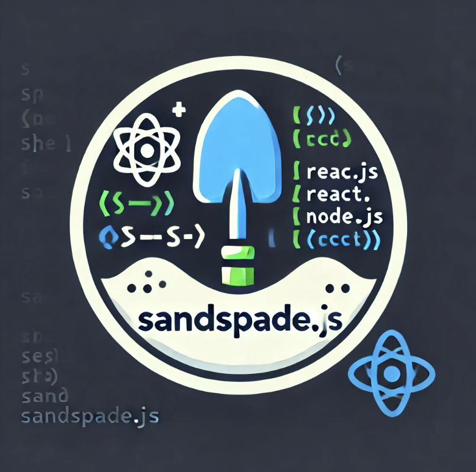

# SandSpade.js

This tool is intended to standardize and simplify the development process across projects, ensuring that common maintenance tasks are easy to execute and well-documented.

The SandSpade.js - Command Runner UI Tool is designed to streamline common development tasks by providing a simple, standardized user interface for executing frequently used terminal commands. This tool is intended to help developers maintain project environments by automating routine tasks like managing dependencies, cleaning up directories, and syncing code repositories.
